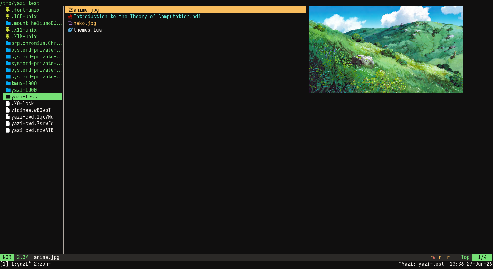

<div align="center">
  
</div>

<h3 align="center">
	Ataraxia flavor for <a href="https://github.com/sxyazi/yazi">Yazi</a>
</h3>

## Preview



## Installation

```sh
ya pkg add ishu-man/ataraxia
```

## Usage

To set it as your dark flavor, change the content of your `theme.toml` to:

```toml
[flavor]
dark = "ataraxia"
```

Make sure your `theme.toml` doesn't contain anything other than `ataraxia`, unless you want to override certain styles of this flavor.
See the [Yazi flavor documentation](https://yazi-rs.github.io/docs/flavors/overview) for more details.

## More Ataraxia

There's a neovim colorscheme by the same name [here](https://github.com/ishu-man/ataraxia.nvim). Ataraxia is my personal colorscheme and I plan to make a repository where I would add all of its ports (ex. the ghostty theme).

## License

The flavor is MIT-licensed, and the included tmTheme is also MIT-licensed.
Check the [LICENSE](LICENSE) and [LICENSE-tmtheme](LICENSE-tmtheme) file for more details.
